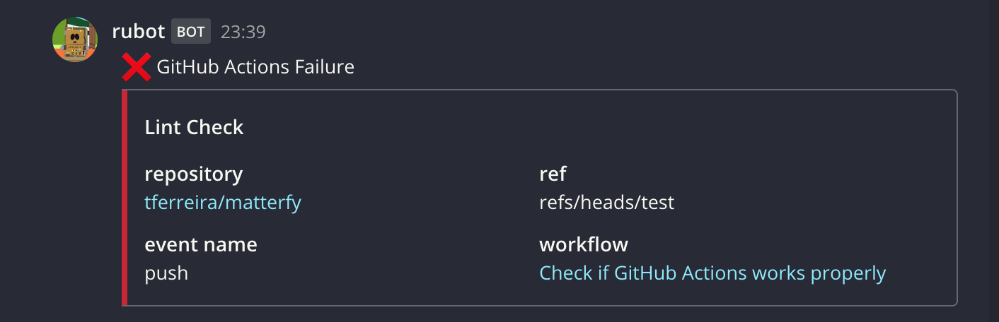
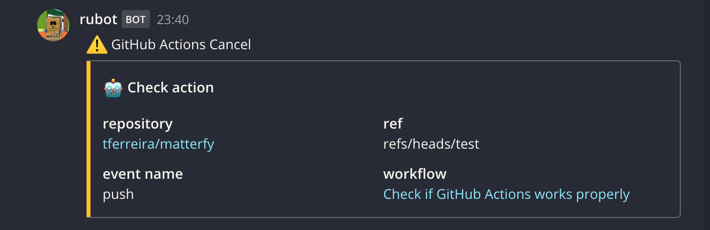

# Matterfy


This is Mattermost Notification for GitHub Actions.<br>
Forked from [homoluctus/slatify](https://github.com/homoluctus/slatify). Thanks a lot for your awesome work!

# Feature
- Notify the result of GitHub Actions

# How to use
First of all, you need to set GitHub secrets for SLACK_WEBHOOK that is Incoming Webhook URL.<br>
You can customize the following parameters:

|with parameter|required/optional|description|
|:--:|:--:|:--|
|type|required|The result of GitHub Actions job<br>This parameter value must contain `success`, `fail` or `cancel`<br>We recommend using ${{ job.status }}|
|job_name|required|Means slack notification title|
|channel|required|Mattermost channel name|
|icon_emoji|optional|Mattermost icon<br>default: octocat|
|username|optional|Mattermost username<br>default: Github Actions|
|url|optional|Mattermost Incoming Webhooks URL<br>Please specify this key or SLACK_WEBHOOK environment variable<br>※SLACK_WEBHOOK will be deprecated|

Please refer `action.yml` for more details.

## Example
```..github/workflows/main.yml
- name: Mattermost Notification
  uses: tferreira/matterfy@releases/v1
  if: always()
  with:
    type: ${{ job.status }}
    job_name: '*Lint Check*'
    channel: 'random'
    url: ${{ secrets.SLACK_WEBHOOK }}
```

# UI Examples 
## Success Case


## Failure Case



## Cancel Case



# LICENSE

[The MIT License (MIT)](https://github.com/tferreira/matterfy/blob/master/LICENSE)